<div align="center">

```
   █████╗ ███╗   ██╗ ██████╗ ███╗   ██╗███████╗ ██████╗ ██████╗  ██████╗███████╗
  ██╔══██╗████╗  ██║██╔═══██╗████╗  ██║██╔════╝██╔═══██╗██╔══██╗██╔════╝██╔════╝
  ███████║██╔██╗ ██║██║   ██║██╔██╗ ██║█████╗  ██║   ██║██████╔╝██║     █████╗
  ██╔══██║██║╚██╗██║██║   ██║██║╚██╗██║██╔══╝  ██║   ██║██╔══██╗██║     ██╔══╝
  ██║  ██║██║ ╚████║╚██████╔╝██║ ╚████║██║     ╚██████╔╝██║  ██║╚██████╗███████╗
  ╚═╝  ╚═╝╚═╝  ╚═══╝ ╚═════╝ ╚═╝  ╚═══╝╚═╝      ╚═════╝ ╚═╝  ╚═╝ ╚═════╝╚══════╝
```

### `Anonforce` — TryHackMe Room Writeup

*A misconfigured FTP server holds the keys — literally — to full root compromise.*

[](https://tryhackme.com/room/bsidesgtanonforce)
[](#)
[](#)
[](#)


</div>

---

## `0x00` Overview

| Field | Detail |
|---|---|
| **Room** | Anonforce |
| **Platform** | TryHackMe |
| **Scenario** | Boot2root machine built for the FIT / BSides Guatemala CTF |
| **Attack Surface** | Anonymous FTP, exposed filesystem, leaked PGP private key, PGP-encrypted backup, SSH |
| **Core Weakness** | Anonymous FTP login exposing the entire filesystem, combined with a weakly-passphrased PGP private key |
| **Objective** | Enumerate FTP anonymously → exfiltrate `private.asc` and `backup.pgp` → crack the key passphrase → decrypt the backup → recover credentials → SSH in → escalate to root |
| **Author** | Kitsana Thuekoh ([@vetementsvmnts](https://github.com/vetementsvmnts)) |

---

## `0x01` Attack Chain

```mermaid
flowchart LR
    A[Nmap Scan] --> B[Anonymous FTP Login]
    B --> C[Filesystem Enumeration]
    C --> D[Exfiltrate private.asc + backup.pgp]
    D --> E[gpg2john Hash Extraction]
    E --> F[John the Ripper Brute Force]
    F --> G[GPG Import + Decrypt backup.pgp]
    G --> H[Recovered Credentials]
    H --> I[SSH Foothold]
    I --> J[Privilege Escalation to Root]

    style A fill:#0d1117,stroke:#00FF41,color:#00FF41
    style B fill:#0d1117,stroke:#00FF41,color:#00FF41
    style C fill:#0d1117,stroke:#00FF41,color:#00FF41
    style D fill:#0d1117,stroke:#00FF41,color:#00FF41
    style E fill:#0d1117,stroke:#00FF41,color:#00FF41
    style F fill:#0d1117,stroke:#ff2020,color:#ff2020
    style G fill:#0d1117,stroke:#00FF41,color:#00FF41
    style H fill:#0d1117,stroke:#00FF41,color:#00FF41
    style I fill:#0d1117,stroke:#00FF41,color:#00FF41
    style J fill:#0d1117,stroke:#ff2020,color:#ff2020
```



---

## `0x02` Reconnaissance

An initial `nmap` scan against the target revealed two open ports:

- **Port 21/tcp** — `vsftpd 3.0.3` (FTP)
- **Port 22/tcp** — `OpenSSH`

The FTP service flagged `ftp-anon: Anonymous FTP login allowed` — the first and most critical misconfiguration on the box.

```bash
nmap -sC -sV <TARGET_IP>
nmap -p- -A <TARGET_IP>
```

<p align="center">
  
  <br/>
  
</p>

---

## `0x03` FTP Enumeration & Exfiltration

Logging in with `anonymous:anonymous` granted full read access to the box's filesystem via FTP. Enumerating `/home` surfaced a user directory (`melodias`) containing the **user flag**, while a suspicious `notread` directory in the filesystem root held two files of interest:

- `private.asc` — a PGP private key
- `backup.pgp` — a PGP-encrypted archive

Both files were pulled down locally using FTP's `get` command for offline analysis.

```bash
ftp <TARGET_IP>
Name: anonymous
Password: anonymous
ftp> cd notread
ftp> get private.asc
ftp> get backup.pgp
```

<p align="center">
  
</p>

---

## `0x04` Key Extraction & Brute Force

`private.asc` was locked behind a passphrase, so it was converted into a crackable hash format using `gpg2john`:

```bash
gpg2john private.asc > pgp.hash
```

<p align="center">
  
</p>

The resulting hash was then brute forced with **John the Ripper** against `rockyou.txt`, recovering the passphrase in seconds:

```bash
john pgp.hash --wordlist=/usr/share/wordlists/rockyou.txt
```

<p align="center">
  
</p>

---

## `0x05` PGP Decryption

With the passphrase recovered, the private key was imported into GPG and used to decrypt `backup.pgp`:

```bash
gpg --import private.asc
gpg --decrypt backup.pgp > backup.txt
```

Decrypting the backup revealed a set of credentials tied to the box's user account.

<p align="center">
  
</p>

---

## `0x06` Foothold & Privilege Escalation

The recovered credentials were used to authenticate over **SSH**, providing an initial foothold on the box. From there, privilege escalation enumeration led directly to root access.

```bash
ssh melodias@<TARGET_IP>
```

<p align="center">
  
</p>

---

## `0x07` Flags

**User Flag:**

<p align="center">
  
</p>

**Root Flag:**

<p align="center">
  
</p>

**Room Completion:**

<p align="center">
  
</p>

---

## `0x08` MITRE ATT&CK Mapping

| Tactic | Technique | ID |
|---|---|---|
| Reconnaissance | Active Scanning | T1595 |
| Initial Access | Exploit Public-Facing Application (Anonymous FTP) | T1190 |
| Discovery | File and Directory Discovery | T1083 |
| Credential Access | Unsecured Credentials — Private Keys | T1552.004 |
| Credential Access | Brute Force — Password Cracking | T1110.002 |
| Credential Access | Unsecured Credentials — Files (backup.pgp) | T1552.001 |
| Lateral Movement | Remote Services — SSH | T1021.004 |
| Privilege Escalation | Valid Accounts | T1078 |

---

## `0x09` Lessons Learned

- **Anonymous FTP with world-readable filesystem access** is a critical exposure — it should never allow traversal beyond an intended upload/share directory.
- **Weak GPG passphrases** are just as crackable as weak account passwords; `gpg2john` + `john`/`hashcat` makes short work of dictionary-guessable keys.
- **Sensitive material left on an accessible service** — a private key and an encrypted backup sitting in plaintext-reachable storage — creates a full compromise chain even without a "real" exploit. Misconfiguration alone was sufficient to reach root.
- **Encryption is only as strong as its passphrase.** `backup.pgp` was cryptographically sound, but the private key protecting it folded to a wordlist attack.

---

## `0x0A` Room Link

🔗 [TryHackMe — Anonforce](https://tryhackme.com/room/bsidesgtanonforce)

---

<div align="center">

`root@target:~#` **Room completed — 100%**

*Writeup by [Kitsana Thuekoh](https://github.com/vetementsvmnts) · Offensive Security Portfolio*

</div>
