<div align="center">

```
 █████╗ ███████╗████████╗███████╗██████╗
██╔══██╗██╔════╝╚══██╔══╝██╔════╝██╔══██╗
███████║███████╗   ██║   █████╗  ██████╔╝
██╔══██║╚════██║   ██║   ██╔══╝  ██╔══██╗
██║  ██║███████║   ██║   ███████╗██║  ██║
╚═╝  ╚═╝╚══════╝   ╚═╝   ╚══════╝╚═╝  ╚═╝
```

### `Aster` — TryHackMe Room Writeup

*A VoIP box that hands out its admin username in a leaked `.pyc` file, then trusts a weak Asterisk Manager password to do the rest.*

[](https://tryhackme.com/room/aster)
[](#)
[](#)
[](#)

</div>

---

## `0x00` Overview

| Field | Detail |
|---|---|
| **Room** | Aster |
| **Platform** | TryHackMe |
| **Scenario** | A server built around the Asterisk open-source communications framework, exposing a web app, a compiled Python bytecode file, and the Asterisk Manager Interface (AMI) |
| **Attack Surface** | Apache web server, a downloadable `.pyc` file, VoIP-related ports (H.323, SCCP), and the Asterisk Manager Interface on `5038/tcp` |
| **Core Weaknesses** | A compiled Python file that decompiles cleanly and leaks a valid AMI username, a weak/brute-forceable AMI password, and the AMI `Originate`/`Command` actions trusting authenticated users to run arbitrary shell commands |
| **Objective** | Enumerate the web app and all TCP ports → recover and decompile the leaked `.pyc` → identify the AMI username → brute-force the AMI password → authenticate to AMI over `nc`/`telnet` → abuse an AMI action for command execution → land a shell and grab the user flag → escalate to root for the final flag |
| **Author** | Kitsana Thuekoh ([@vetementsvmnts](https://github.com/vetementsvmnts)) |

---

## `0x01` Attack Chain

```mermaid
flowchart LR
    A[Nmap All-Ports Scan] --> B[Web App Enumeration - Port 80]
    B --> C[Download Leaked .pyc File]
    C --> D[Decompile .pyc]
    D --> E[Recover AMI Username]
    A --> F[Identify Asterisk AMI - Port 5038]
    E --> G[Brute-Force AMI Password]
    F --> G
    G --> H[Authenticate to AMI]
    H --> I[Abuse AMI Action for RCE]
    I --> J[Shell as Asterisk User]
    J --> K[User Flag]
    J --> L[Privilege Escalation Enumeration]
    L --> M[Escalate to Root]
    M --> N[Root Flag]

    style A fill:#0d1117,stroke:#00FF41,color:#00FF41
    style B fill:#0d1117,stroke:#00FF41,color:#00FF41
    style C fill:#0d1117,stroke:#00FF41,color:#00FF41
    style D fill:#0d1117,stroke:#00FF41,color:#00FF41
    style E fill:#0d1117,stroke:#ff2020,color:#ff2020
    style F fill:#0d1117,stroke:#00FF41,color:#00FF41
    style G fill:#0d1117,stroke:#ff2020,color:#ff2020
    style H fill:#0d1117,stroke:#00FF41,color:#00FF41
    style I fill:#0d1117,stroke:#ff2020,color:#ff2020
    style J fill:#0d1117,stroke:#00FF41,color:#00FF41
    style K fill:#0d1117,stroke:#00FF41,color:#00FF41
    style L fill:#0d1117,stroke:#00FF41,color:#00FF41
    style M fill:#0d1117,stroke:#ff2020,color:#ff2020
    style N fill:#0d1117,stroke:#00FF41,color:#00FF41
```



---

## `0x02` Reconnaissance

A full-port `nmap` scan (the default top-1000 misses several of the VoIP-related ports here) identified five open services:

```bash
nmap -sC -sV -p- -T4 <TARGET_IP>
```

- **Port 22/tcp** — `OpenSSH`
- **Port 80/tcp** — Apache httpd, hosting a page titled "Aster CTF"
- **Port 1720/tcp** — H.323 call signaling (`h323q931`)
- **Port 2000/tcp** — Cisco SCCP (`cisco-sccp`)
- **Port 5038/tcp** — `Asterisk Call Manager` — the Asterisk Manager Interface (AMI)

> **Notes to fill in:** paste your actual `nmap` output here, including exact version strings.

---

## `0x03` Web Enumeration — Leaked `.pyc`

The web app on port 80 offered a downloadable file. Rather than a plain script, it turned out to be a compiled Python bytecode file (`.pyc`), which was pulled down and decompiled locally to recover the original source.

```bash
wget http://<TARGET_IP>/<downloaded_file>.pyc
uncompyle6 <downloaded_file>.pyc
# or: decompyle3 / pycdc, depending on the Python version the .pyc targets
```

The decompiled source leaked a valid **AMI username**, pointing directly at the service found on port 5038.

> **Notes to fill in:** the actual filename, which decompiler worked for the bytecode version, and the recovered username.

---

## `0x04` Asterisk Manager Interface — Discovery

The Asterisk Manager Interface (AMI) is a text-based, line-oriented protocol used to control an Asterisk PBX programmatically — call control, channel status, and administrative actions all go through it once authenticated. A raw banner grab confirmed the service and its version:

```bash
nc <TARGET_IP> 5038
# Asterisk Call Manager/5.0.2
```

With a valid username already in hand from the `.pyc`, the only missing piece was the password.

---

## `0x05` AMI Password Brute Force

The AMI `Login` action accepts a username/secret pair over the raw socket. This was scripted/brute-forced against a wordlist using the recovered username, either via a custom Python script speaking the AMI protocol directly, or Metasploit's `auxiliary/scanner/misc/asterisk_ami_login` module.

```python
# Example shape of an AMI login attempt over a raw socket
Action: Login
Username: <recovered_username>
Secret: <candidate_password>
```

```bash
# Metasploit alternative
use auxiliary/scanner/misc/asterisk_ami_login
set RHOSTS <TARGET_IP>
set USERNAME <recovered_username>
set PASS_FILE /usr/share/wordlists/rockyou.txt
run
```

> **Notes to fill in:** which method you actually used, and the recovered password (redact if you'd rather not publish it).

---

## `0x06` AMI Authentication & Remote Code Execution

Authenticating to AMI with the recovered credentials opened up the full action set. Login is a two-newline-terminated block over the raw socket:

```bash
telnet <TARGET_IP> 5038
```

```
Action: Login
Username: <recovered_username>
Secret: <recovered_password>

```

From an authenticated session, AMI actions such as `Originate` (with an Application/Command combination) or the raw `Command` action can be abused to run arbitrary shell commands under the context of the Asterisk process, effectively turning the manager interface into a remote shell primitive.

```
Action: Command
Command: <shell_command>

```

> **Notes to fill in:** the exact AMI action/payload that got you code execution, and how you turned that into an interactive shell (reverse shell one-liner, `Originate` + `System()` dialplan trick, etc.).

---

## `0x07` Foothold — User Flag

Command execution through AMI was used to establish an interactive shell back to a listener, landing access as the Asterisk service user, where the user flag was recovered.

```bash
nc -lvnp <PORT>
```

> **Notes to fill in:** the home directory / path where the user flag was found, and the username you landed as.

---

## `0x08` Privilege Escalation — Root Flag

Standard privilege escalation enumeration (`sudo -l`, SUID binaries, cron jobs, writable service files, kernel version) was used from the foothold shell to identify a path to root.

```bash
sudo -l
find / -perm -4000 -type f 2>/dev/null
```

> **Notes to fill in:** the actual privesc vector for this box (this varies across THM room revisions — fill in what you found: a `sudo` misconfiguration, a vulnerable SUID binary, a cron job, etc.), the commands used to exploit it, and where the root flag was located.

---

## `0x09` Room Completion

Room completed with both flags captured.

---

## `0x0A` MITRE ATT&CK Mapping

| Tactic | Technique | ID |
|---|---|---|
| Reconnaissance | Active Scanning | T1595 |
| Discovery | Network Service Discovery | T1046 |
| Reconnaissance | Search Victim-Owned Websites (leaked `.pyc`) | T1594 |
| Credential Access | Brute Force — AMI password | T1110 |
| Initial Access | Valid Accounts | T1078 |
| Execution | Command and Scripting Interpreter | T1059 |
| Command and Control | Application Layer Protocol abuse (AMI) | T1071 |
| Privilege Escalation | *(fill in based on actual vector — e.g. T1548 Setuid/Setgid Abuse, T1053 Scheduled Task/Job)* | — |

---

## `0x0B` Lessons Learned

- **Compiled doesn't mean secret.** A `.pyc` file is trivially decompiled back to near-original source; shipping credentials or usernames inside one is no different from leaving them in plaintext.
- **Management interfaces need the same password hygiene as SSH.** AMI grants powerful control over an Asterisk box — a weak or default `Secret` on it is equivalent to a weak root password.
- **"Internal" protocols still need auth review.** AMI's `Command`/`Originate` actions are meant for legitimate call control automation, but from an attacker's seat they're a direct line to shell execution once authenticated.

---

## `0x0C` Room Link

🔗 [TryHackMe — Aster](https://tryhackme.com/room/aster)

---

<div align="center">

`root@target:~#` **Room completed — flags captured**

*Writeup by [Kitsana Thuekoh](https://github.com/vetementsvmnts) · Offensive Security Portfolio*

</div>
