<div align="center">

```
████████╗███████╗ ██████╗██╗  ██╗    ███████╗██╗   ██╗██████╗ ██████╗  ██████╗ ██████╗ ████████╗
╚══██╔══╝██╔════╝██╔════╝██║  ██║    ██╔════╝██║   ██║██╔══██╗██╔══██╗██╔═████╗██╔══██╗╚══██╔══╝
   ██║   █████╗  ██║     ███████║    ███████╗██║   ██║██████╔╝██████╔╝██║██╔██║██████╔╝   ██║
   ██║   ██╔══╝  ██║     ██╔══██║    ╚════██║██║   ██║██╔═══╝ ██╔═══╝ ████╔╝██║██╔══██╗   ██║
   ██║   ███████╗╚██████╗██║  ██║    ███████║╚██████╔╝██║     ██║     ╚██████╔╝██║  ██║   ██║
   ╚═╝   ╚══════╝ ╚═════╝╚═╝  ╚═╝    ╚══════╝ ╚═════╝ ╚═╝     ╚═╝      ╚═════╝ ╚═╝  ╚═╝   ╚═╝
```

### `Tech_Supp0rt: 1` — TryHackMe Room Writeup

*Hack into the scammer's under-development website to foil their plans.*

[](https://tryhackme.com/room/techsupp0rt1)
[](#)
[](#)
[](https://nvd.nist.gov/vuln/detail/CVE-2018-19422)

</div>

---

## `0x00` Overview

| Field | Detail |
|---|---|
| **Room** | Tech_Supp0rt: 1 |
| **Platform** | TryHackMe |
| **Scenario** | Compromise a scammer's in-development website to disrupt an active tech-support scam operation |
| **Attack Surface** | SMB file shares, encoded credential material, Subrion CMS admin panel |
| **Core Vulnerability** | CVE-2018-19422 — Subrion CMS 4.2.1 authenticated arbitrary file upload (`.pht`/`.phar`) leading to RCE via `/panel/uploads` |
| **Objective** | Enumerate SMB shares → recover and decode staged data → authenticate to the Subrion CMS admin panel → exploit CVE-2018-19422 for code execution → catch a reverse shell → extract further credentials from the host → escalate access |
| **Author** | Kitsana Thuekoh ([@vetementsvmnts](https://github.com/vetementsvmnts)) |

<p align="center">

</p>

---

## `0x01` Attack Chain

```mermaid
flowchart LR
    A[Nmap Scan] --> B[SMB Enumeration + File Download]
    B --> C[enter.txt Retrieval]
    C --> D[CyberChef Decoding]
    D --> E[Subrion CMS Admin Login]
    E --> F[CVE-2018-19422 Exploit]
    F --> G[Netcat Reverse Shell]
    G --> H[WordPress Config Extraction]
    H --> I[Passwd Enumeration]
    I --> J[SSH Connection Attempt]

    style A fill:#0d1117,stroke:#00FF41,color:#00FF41
    style B fill:#0d1117,stroke:#00FF41,color:#00FF41
    style C fill:#0d1117,stroke:#00FF41,color:#00FF41
    style D fill:#0d1117,stroke:#00FF41,color:#00FF41
    style E fill:#0d1117,stroke:#00FF41,color:#00FF41
    style F fill:#0d1117,stroke:#ff2020,color:#ff2020
    style G fill:#0d1117,stroke:#00FF41,color:#00FF41
    style H fill:#0d1117,stroke:#00FF41,color:#00FF41
    style I fill:#0d1117,stroke:#00FF41,color:#00FF41
    style J fill:#0d1117,stroke:#00FF41,color:#00FF41
```



---

## `0x02` Reconnaissance

An initial `nmap` scan established the exposed service footprint, followed by a full-port sweep to confirm nothing was missed on higher port ranges.

```bash
nmap -sC -sV <TARGET_IP>
nmap -p- -T4 <TARGET_IP>
```

<p align="center">
  
</p>
<p align="center">
  
</p>

**Key findings:** SMB exposed alongside a web service consistent with the scenario's "under development" scammer site.

---

## `0x03` SMB Enumeration & File Download

`smbclient` was used to enumerate available shares. Anonymous access allowed listing and retrieval of files staged on the share.

```bash
smbclient -L //<TARGET_IP>/ -N
smbclient //<TARGET_IP>/<SHARE_NAME> -N
```

<p align="center">
  
</p>

---

## `0x04` enter.txt — Contents & Exploit Retrieval

A file named `enter.txt` retrieved from the share contained data pointing toward the vulnerable component on the host. This lead was used to identify the target CMS and pull down a working exploit for **CVE-2018-19422** (Subrion CMS 4.2.1 authenticated file upload bypass).

<p align="center">
  
</p>

---

## `0x05` Credential Recovery — CyberChef Decoding

Data recovered from the share was not stored in plaintext. It was run through **CyberChef** to identify and reverse the encoding, recovering credentials usable against the Subrion CMS admin panel.

<p align="center">
  
</p>

> **Takeaway:** Encoding is not encryption. Files staged on a share "for later" are a recurring source of credential leakage — in CTFs and in real engagements alike.

---

## `0x06` Initial Access — Subrion CMS (CVE-2018-19422)

The recovered credentials granted access to the **Subrion CMS admin panel**. Subrion 4.2.1's `/panel/uploads` endpoint fails to block `.pht`/`.phar` uploads at the `.htaccess` level, allowing an authenticated user to upload and execute arbitrary PHP.

<p align="center">
  
</p>
<p align="center">
  
</p>

```bash
python3 CVE-2018-19422.py -u http://<TARGET_IP>/panel/ -l <user> -p <password>
```

---

## `0x07` Foothold — Netcat Reverse Shell & WordPress Config Extraction

Code execution via the uploaded payload was used to catch a reverse shell with `netcat`. From the foothold, a WordPress configuration file present on the host was located and pulled for further credential material.

```bash
# Listener
nc -lvnp <PORT>
```

<p align="center">
  
</p>

Shell stabilization:

```bash
python3 -c 'import pty; pty.spawn("/bin/bash")'
export TERM=xterm
Ctrl+Z
stty raw -echo; fg
```

---

## `0x08` wp-config.php — Credential Extraction

The extracted WordPress configuration file was read directly to recover database and/or user credentials reused elsewhere on the host.

```bash
cat wp-config.php
```

<p align="center">
  
</p>

---

## `0x09` Privilege Escalation Path — Passwd Enumeration & SSH

Local user accounts were enumerated via `/etc/passwd` to identify valid usernames, and the credentials recovered from `wp-config.php` were tested against SSH to pivot into a stable, higher-privilege session.

```bash
cat /etc/passwd
ssh <user>@<TARGET_IP>
```

<p align="center">
  
</p>

---

## `0x0A` Root Flag

With SSH access established using the recovered credentials, final privilege escalation was completed and the root flag was captured, closing out the room.

<p align="center">
  
</p>

---

## `0x0B` MITRE ATT&CK Mapping

| Tactic | Technique | ID |
|---|---|---|
| Reconnaissance | Active Scanning | T1595 |
| Discovery | Network Share Discovery | T1135 |
| Discovery | Account Discovery (`/etc/passwd`) | T1087.001 |
| Credential Access | Unsecured Credentials — Files (SMB, wp-config.php) | T1552.001 |
| Defense Evasion / Analysis | Deobfuscate/Decode Files or Information (CyberChef) | T1140 |
| Initial Access | Valid Accounts (CMS admin login) | T1078 |
| Initial Access | Exploit Public-Facing Application (CVE-2018-19422) | T1190 |
| Execution | Unix Shell | T1059.004 |
| Command & Control | Ingress Tool Transfer / Reverse Shell | T1105 |
| Lateral Movement | Remote Services — SSH | T1021.004 |

---

## `0x0C` Lessons Learned

- **Share hygiene matters.** Anonymous SMB access to files staged "for later" (like `enter.txt`) is a low-effort, high-yield attack path.
- **Encoding ≠ security.** Base64-style encodings staged on a share do nothing against an attacker with local file read access.
- **Patch known CVEs.** CVE-2018-19422 has been public since 2018; running Subrion CMS 4.2.1 unpatched with a reachable admin panel is a direct path to RCE.
- **Don't reuse credentials across services.** Reusing WordPress database/user credentials for system-level SSH access turns a single leak into full host compromise.

---

<div align="center">

`root@target:~#` **Room completed — 100%**

*Writeup by [Kitsana Thuekoh](https://github.com/vetementsvmnts) · Offensive Security Portfolio*

</div>
